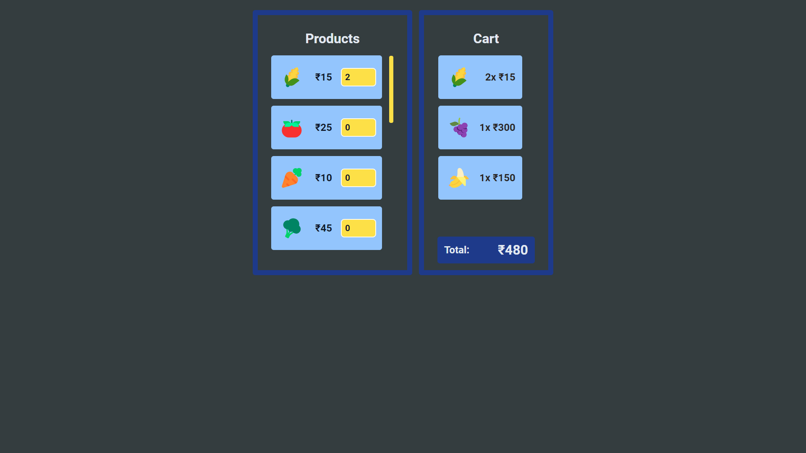

# Module#5 React Day #13 Homework 2: CartTotal WebApp


## Hosted Version of the Project:
[m5react-day-13-homework-2-carttotal-webapp](https://m5react-day-13-homework-2-carttotal-webapp.vercel.app/)

## Project Overview:
Create a component with two boxes side by side as shown in the picture. The left box should show the list of products available in the store along with the add and remove button against each product. The product quantity which is added in the cart is also show between the two buttons. The right box should show the cart with products added along with quantity and total Price.

## Objectives
1. The Cart should be empty when the component is loaded.
2. On Click of '+' button, the product should be added to cart.
3. On Click of '-' button, the product should be subtracted from cart.
4. If no product is in the cart, display "No Product added to the cart".
5. You can use useState, redux is not compulsory.
6. Use separate component for left and right boxes.


## How to install and run in yours local machine
```bash
npm install
npm run start
```

## Tech. Stack Used:
+ [React](https://react.dev/)
+ [TailwindCSS](https://tailwindcss.com/)
+ [Google Fonts](https://fonts.google.com/)
+ [Font Awesome](https://fontawesome.com/icons/)

## Author
[Abhishek kumar](https://www.linkedin.com/in/alex21c/), ([Geekster](https://geekster.in/) MERN Stack FS-14 Batch)


